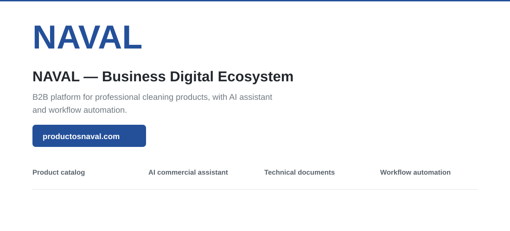

### Architecture
~~~mermaid
flowchart LR
 C[Customer] --> W[React + Vite]
 W --> CAT[Catalog]
 W --> CHAT[Commercial assistant]
 CHAT --> K[Product knowledge]
 CHAT --> API[Serverless API]
 API --> M[Make]
 API --> O[OpenAI fallback]
 ERP[Private ERP] -. separate .-> W
~~~

<strong>Run locally & repository structure</strong>

~~~bash
npm install
cp .env.example .env.local
npm run dev
~~~

~~~text
src/        UI, catalog, product data and assistant
api/        Serverless integration boundary
public/     Technical documents, SEO and assets
scripts/    Sitemap and automation utilities
~~~

Make and OpenAI credentials remain server-side and are not stored in the repository.

<strong>Production:</strong> https://www.productosnaval.com/

